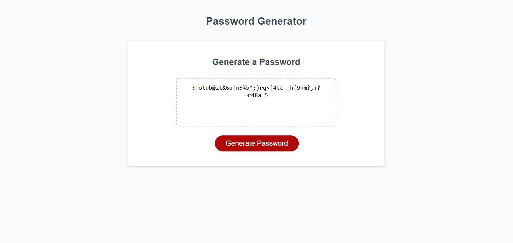

# Password Generator Starter Code

## Description

This project is an application that an employee can use to generate a random password based on criteria they’ve selected.
The password can include special characters(https://owasp.org/www-community/password-special-characters).  

## Tasks completed

* Was structured git hub repository with deployed result web page.
* Was aded function to generate random password by accepted citeria.
* Was reconstructed local start point code and files structure.
* Was added some responsibility to css code. 
* Was added conditional loops to protect right enters for password length 

## Links

* deployed website https://am0726github.github.io/password-challenge/

* Code repository https://github.com/AM0726Github/password-challenge

## Screenshot of Web page

## References and tutorials utilized

* https://stackoverflow.com/questions/9719570/generate-random-password-string-with-requirements-in-javascript/9719815
* https://www.w3schools.com/js
